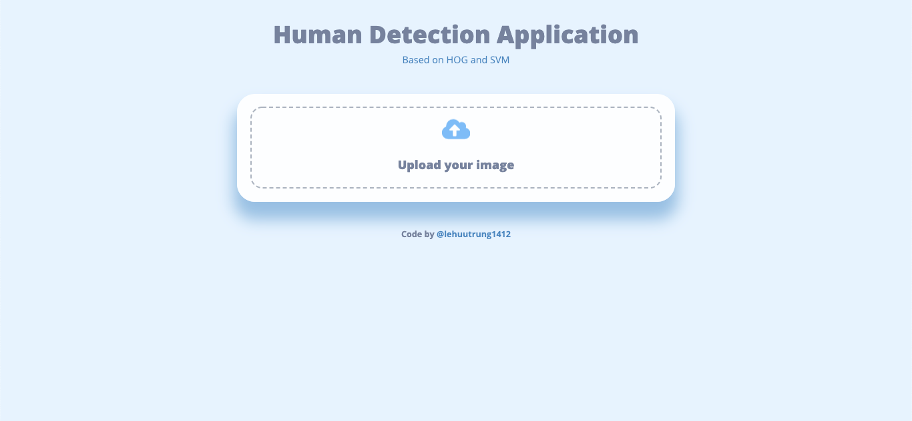
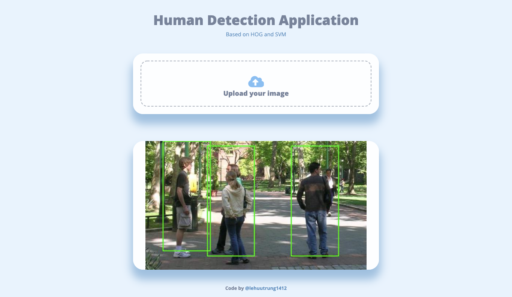

# Person Detection Application

## About this project

This is the final project of my subject, Introduction to Computer Vision. I built a web application to detect people in images using Histogram of Oriented Gradients (HOG) for extracting features and Support Vector Machine (SVM) for classifying.

In addition, I also built a detection using Yolov4 darknet53.

## Technology

* Frontend: Bootstrap
* Backend: Flask

## How it works?

1. HOG & SVM
    * Train SVM model with HOG descriptor
        1. Load positive and negative image with size 64x128, convert to grayscale and get label of them
        2. Get HOG feature vector of each image
        3. Fit to LinearSVM model
    * Detect with SVM model
        1. Resize image to suitable size
        2. Use pyramid multi-scale to generate images with downscale size
        3. Use sliding window with size 64x128 to slide through all the pyramid images
        4. Get HOG feature vector at each window, use model to detect that feature belongs to class positive or negative. Save that window if it is a positive window
        5. Apply Non-Maximum Suppression (NMS) to remove the window overlapped over thresh.
        6. Draw rectangles
2. Yolov4
   
    Just build and detect model following the guide. In this app, I loaded yolo architecture using cv2.dnn darknet.

## How to run?

To start server test, you can run:
```
python app/app.py
```

## How to build?

Update soon...

## How to use?

Just drag and drop or click in upload image area to select an image. After that, the person detected image will be returned.

## Screenshots





## Feedback

* If my project is useful for you, please mark ⭐ it on Github and share it with your friends. Thank you!
* Have any questions? Open an issue on this project.

## Reference

* Training HOG with SVM: [@RashadGarayev](https://github.com/RashadGarayev/PersonDetection)
* Training Yolo: [@pjreddie](https://github.com/pjreddie/darknet)
